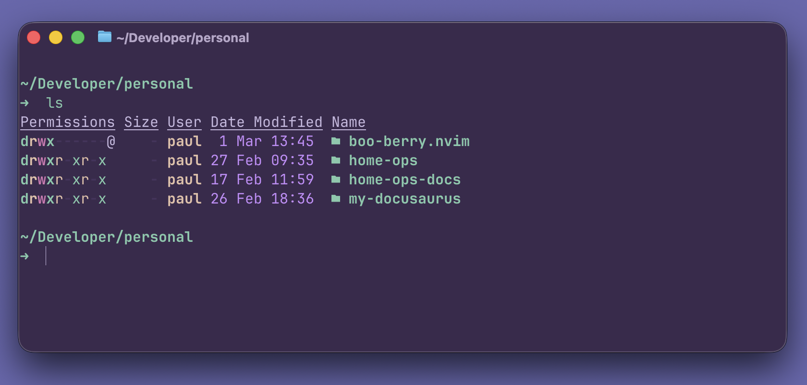

<h3 align="center">
     
 BooBerry for <a href="https://github.com/ghostty-org">Ghostty</a>
</h3>

 
 
 

 

### Install

1. Download the file for your flavor of choice from [`themes/`](./themes/) to the `themes/` subdirectory of your [Ghostty configuration _directory_](https://ghostty.org/docs/config#file-location) (i.e. `~/.config/ghostty/themes/`).
2. Set `theme = boo-berry` in your [Ghostty configuration _file_](https://ghostty.org/docs/config#file-location).
3. Reload or restart Ghostty.

> [!NOTE]
> For further theme configuration reference, see <https://ghostty.org/docs/config/reference#theme>.

## 💝 Thanks to

- [dbozbay](https://github.com/dbozbay)

&nbsp;

 Copyright &copy; 2026-present <a href="https://github.com/booberrytheme" target="_blank">BooBerrryTheme Org</a>

 

